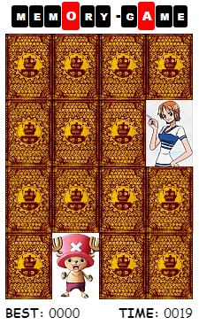

react-memory-game
================

This project was bootstrapped with [Next.JS](https://nextjs.org/).

## Objective
This is the [React.JS](https://reactjs.org/)
version of the same memory game I made using [Vue.Js](https://vuejs.org/).
This is just a quick practice exercise.

## Description



Click on the cards and match two to hide it.
Complete all eight pairs to end game.

## Installation
Clone repository and run

```
npm install
```


## Run
Runs the app in the development mode

```
npm run dev
```

Open [http://localhost:3000](http://localhost:3000) to view it in the browser.

The page will reload if you make edits.<br>
You will also see any lint errors in the console.


## Todo
Make custom element instead of using DIV.
